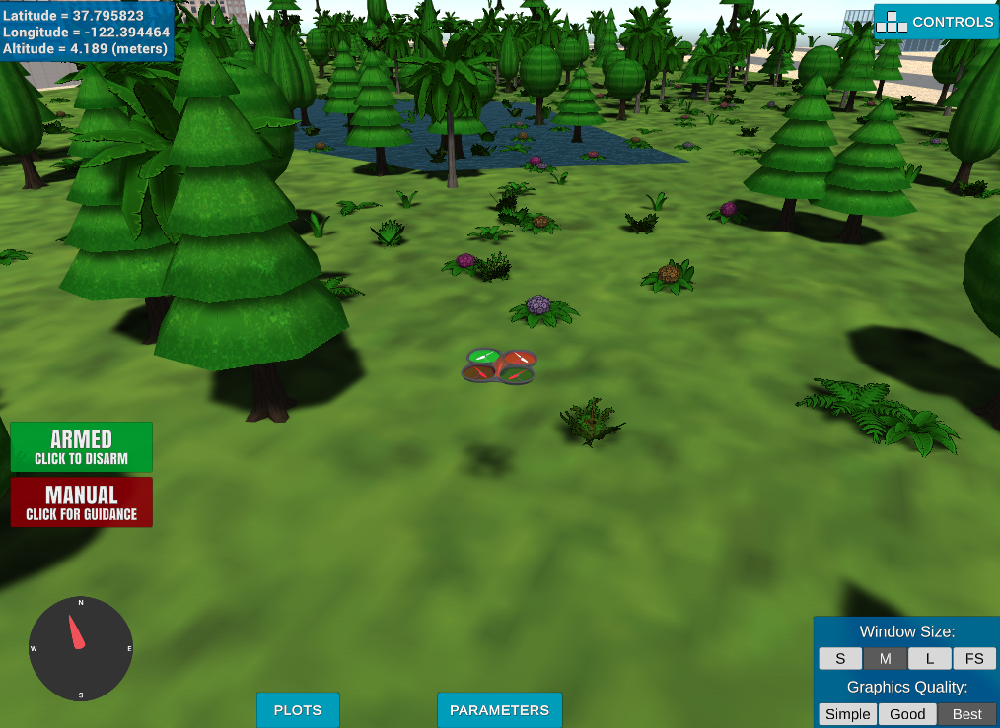

## Project: 3D Motion Planning

## [Rubric](https://review.udacity.com/#!/rubrics/1534/view) Points

---

### Explain the Starter Code

#### 1. Explain the functionality of what's provided in `motion_planning.py` and `planning_utils.py`
In the first project (Backyard Flyer) we assumed / did not consider the obstacles there by had a static set of way points. However in a real world scenario , Planning consitutes an important role and it has been incorporated in this project (Motion Planning)

The additional funcationalities in `motion_planning.py` & `planning_utils.py` includes

[Motion planning](motion_planning.py)
1. Introduction of `Planning` State & `plan_path()` & `send_waypoints` method.

[Planning Util](planning_utils.py)
 
1. `Create_grid` method to define a grid & set a safety margin.
2. `a_star` method that finds the 'Ideal' path between start and the goal.

### Implementing Your Path Planning Algorithm

#### 1. Set your global home position
Here students should read the first line of the csv file, extract lat0 and lon0 as floating point values and use the self.set_home_position() method to set global home. Explain briefly how you accomplished this in your code.

And here is a lovely picture of our downtown San Francisco environment from above!

#### 2. Set your current local position
Here as long as you successfully determine your local position relative to global home you'll be all set. Explain briefly how you accomplished this in your code.

Meanwhile, here's a picture of me flying through the trees!

#### 3. Set grid start position from local position
This is another step in adding flexibility to the start location. As long as it works you're good to go!

#### 4. Set grid goal position from geodetic coords
This step is to add flexibility to the desired goal location. Should be able to choose any (lat, lon) within the map and have it rendered to a goal location on the grid.

#### 5. Modify A* to include diagonal motion (or replace A* altogether)
Minimal requirement here is to modify the code in planning_utils() to update the A* implementation to include diagonal motions on the grid that have a cost of sqrt(2), but more creative solutions are welcome. Explain the code you used to accomplish this step.

#### 6. Cull waypoints 
For this step you can use a collinearity test or ray tracing method like Bresenham. The idea is simply to prune your path of unnecessary waypoints. Explain the code you used to accomplish this step.

### Execute the flight
#### 1. Does it work?
It works!

### Double check that you've met specifications for each of the [rubric](https://review.udacity.com/#!/rubrics/1534/view) points.
  
# Extra Challenges: Real World Planning

For an extra challenge, consider implementing some of the techniques described in the "Real World Planning" lesson. You could try implementing a vehicle model to take dynamic constraints into account, or implement a replanning method to invoke if you get off course or encounter unexpected obstacles.

